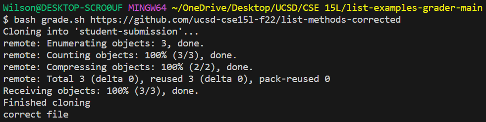
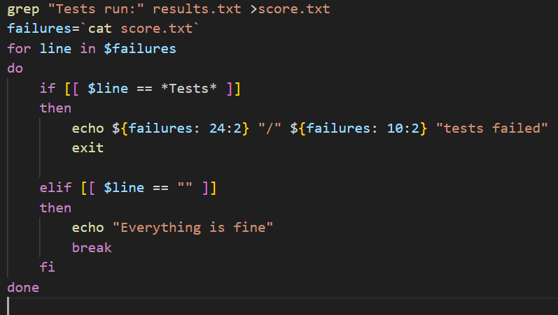
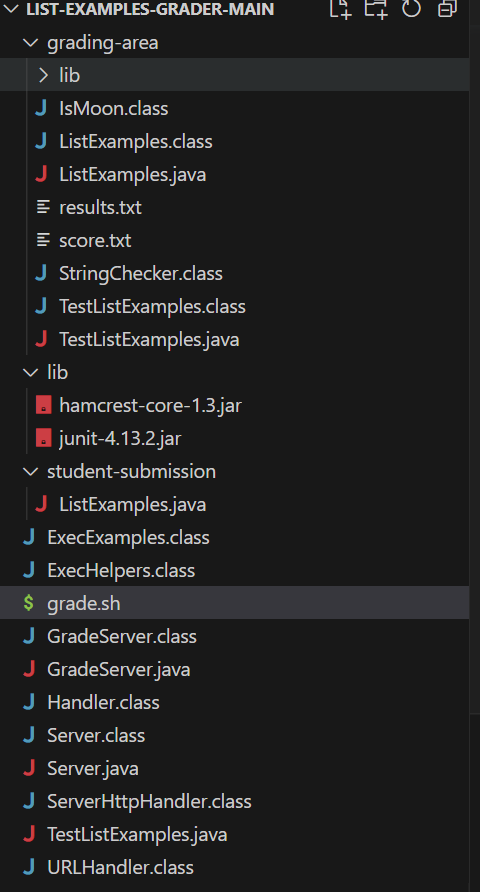

# Lab Report 5
## Debugging Scenario
### Part 1 Edstem Question:
**What environment are you using (computer, operating system, web browser, terminal/editor, and so on)?**

PC, Windows 10, google chrome, Visual Studio Code, Bash terminal. 


**Detail the symptom you're seeing. Be specific; include both what you're seeing and what you expected to see instead. Screenshots are great, copy-pasted terminal output is also great. Avoid saying “it doesn't work”.**  

In my grading script, I am encountering this issue where can't get my if statements to echo the messages correctly. I believe that this is due to the fact that the elif statement is not triggering properly. In the code below, I wanted it to echo "Everything is fine" when the $line is an empty string, where the $line represents the first word found in a variable called failures which contains the line from a Junit Test where it says Tests run: some number, Failures: some number. I expected this variable failure to be empty, which is why I wrote the elif to be in that manner, but as you can see in the output below nothing gets echoed by the if statements.




**Detail the failure-inducing input and context. That might mean any or all of the command you're running, a test case, command-line arguments, working directory, even the last few commands you ran. Do your best to provide as much context as you can.**  

As shown in those screenshots above, the failure inducing input is when I try to pass in a submission that is supposed to pass all JUnit tests. I belive the issue to be with how the elif is written but I cant seem to figure out how to correctly write this.

### Part 2 Response from TA:

Hi I think if you are attempting to only have one if statement and one elif statement, since you have stated that your if statement is functioning properly but not your elif statement, then try removing the elif and putting its commands outside of this for loop instead. 

### Part 3 Fixing the bug

After following the advice and changing the code to the screenshot below. It was in fact the elif statement that was the bug, and simply having the echo "Everything is fine" outside the for loop seemed to work and fix the program as seen in the output below. It also won't echo twice from the if statement since the if statement contains an exit command if executed. 

### Part 4 All Setup Information

**The file & directory structure needed**



working directory is ~/OneDrive/Desktop/UCSD/CSE 15L/list-examples-grader-main

**The contents of each file before fixing the bug**

**Contents of Grade Server remain the same:**
```
import java.io.BufferedReader;
import java.io.IOException;
import java.io.InputStream;
import java.io.InputStreamReader;
import java.net.URI;
import java.net.URISyntaxException;
import java.util.Arrays;
import java.util.stream.Stream;

class ExecHelpers {

  /**
    Takes an input stream, reads the full stream, and returns the result as a
    string.

    In Java 9 and later, new String(out.readAllBytes()) would be a better
    option, but using Java 8 for compatibility with ieng6.
  */
  static String streamToString(InputStream out) throws IOException {
    String result = "";
    while(true) {
      int c = out.read();
      if(c == -1) { break; }
      result += (char)c;
    }
    return result;
  }

  /**
    Takes a command, represented as an array of strings as it would by typed at
    the command line, runs it, and returns its combined stdout and stderr as a
    string.
  */
  static String exec(String[] cmd) throws IOException {
    Process p = new ProcessBuilder()
                    .command(Arrays.asList(cmd))
                    .redirectErrorStream(true)
                    .start();
    InputStream outputOfBash = p.getInputStream();
    return String.format("%s\n", streamToString(outputOfBash));
  }

}

class Handler implements URLHandler {
    public String handleRequest(URI url) throws IOException {
       if (url.getPath().equals("/grade")) {
           String[] parameters = url.getQuery().split("=");
           if (parameters[0].equals("repo")) {
               String[] cmd = {"bash", "grade.sh", parameters[1]};
               String result = ExecHelpers.exec(cmd);
               return result;
           }
           else {
               return "Couldn't find query parameter repo";
           }
       }
       else {
           return "Don't know how to handle that path!";
       }
    }
}

class GradeServer {
    public static void main(String[] args) throws IOException {
        if(args.length == 0){
            System.out.println("Missing port number! Try any number between 1024 to 49151");
            return;
        }

        int port = Integer.parseInt(args[0]);

        Server.start(port, new Handler());
    }
}

class ExecExamples {
  public static void main(String[] args) throws IOException {
    String[] cmd1 = {"ls", "lib"};
    System.out.println(ExecHelpers.exec(cmd1));

    String[] cmd2 = {"pwd"};
    System.out.println(ExecHelpers.exec(cmd2));

    String[] cmd3 = {"touch", "a-new-file.txt"};
    System.out.println(ExecHelpers.exec(cmd3));
  }
}

```

**grade.sh before fix**
```
CPATH='.:lib/hamcrest-core-1.3.jar:lib/junit-4.13.2.jar'

rm -rf student-submission
rm -rf grading-area

mkdir grading-area

git clone $1 student-submission
echo 'Finished cloning'
files=`find student-submission/*`
for file in $files
do
    if [[ -f $file ]] && [[ $file == *ListExamples.java* ]]
    then
        echo "correct file"
        cp student-submission/ListExamples.java grading-area/
        cp TestListExamples.java grading-area/
        cp -r lib grading-area

        
    else 
        echo "This is not the correct file!"
        
    fi
done

cd grading-area
javac ListExamples.java 
javac -cp ".;lib/hamcrest-core-1.3.jar;lib/junit-4.13.2.jar" *.java
java -cp ".;lib/junit-4.13.2.jar;lib/hamcrest-core-1.3.jar" org.junit.runner.JUnitCore TestListExamples >results.txt

grep "Tests run:" results.txt >score.txt
failures=`cat score.txt`
for line in $failures
do
    if [[ $line == *Tests* ]]
    then
        echo ${failures: 24:2} "/" ${failures: 10:2} "tests failed"
        exit
    elif [[ $line == "" ]]
    then
        echo "Everything is fine"
        break
    
    fi
done
```

**grade.sh after fix**
```
CPATH='.:lib/hamcrest-core-1.3.jar:lib/junit-4.13.2.jar'

rm -rf student-submission
rm -rf grading-area

mkdir grading-area

git clone $1 student-submission
echo 'Finished cloning'
files=`find student-submission/*`
for file in $files
do
    if [[ -f $file ]] && [[ $file == *ListExamples.java* ]]
    then
        echo "correct file"
        cp student-submission/ListExamples.java grading-area/
        cp TestListExamples.java grading-area/
        cp -r lib grading-area

        
    else 
        echo "This is not the correct file!"
        
    fi
done

cd grading-area
javac ListExamples.java 
javac -cp ".;lib/hamcrest-core-1.3.jar;lib/junit-4.13.2.jar" *.java
java -cp ".;lib/junit-4.13.2.jar;lib/hamcrest-core-1.3.jar" org.junit.runner.JUnitCore TestListExamples >results.txt

grep "Tests run:" results.txt >score.txt
failures=`cat score.txt`
for line in $failures
do
    if [[ $line == *Tests* ]]
    then
        echo ${failures: 24:2} "/" ${failures: 10:2} "tests failed"
        exit
    
    
    fi
done


echo "Everything is fine"
```


**The full command line (or lines) you ran to trigger the bug**

`bash grade.sh https://github.com/ucsd-cse15l-f22/list-methods-corrected`

**A description of what to edit to fix the bug**

Remove the elif part and put echo "Everything is fine" outside the for loop. 

## Reflection

This second half I think I learned two important things. The first is more specific to bash and that is the importance of spaces in this coding language. I encountered so many errors while doing my grade.sh grading script due to these spaces. The second thing I learned is how simple it is to learn new coding languages with all the online resources such as documentations, stackoverflow and chatGPT, especially after having an understanding of other coding languages already. I think this is reflective of how the logic behind most coding languages are very similar and that logic is what is important. 
